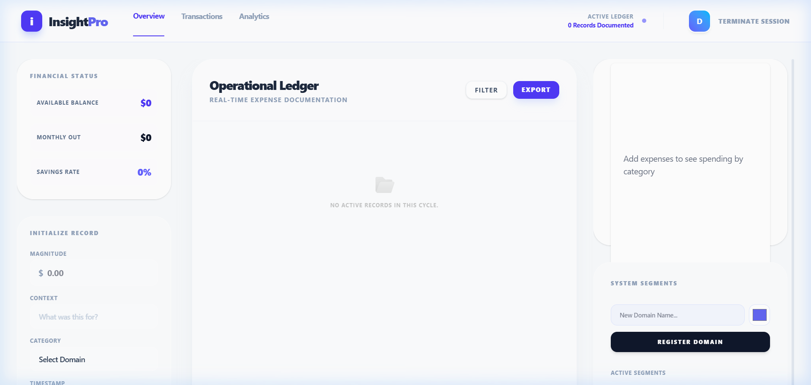

# InsightPro

Experience the next generation of financial tracking with **Horizontal Intelligence**. Optimized for wide-screen utility, InsightPro eliminates vertical scrolling by delivering side-by-side snapshots, ledgers, and analytics in a high-fidelity, frosted-glass interface.

---

## 📽️ Tutorial & Full Feature Walkthrough

> Click to watch — a 1-minute walkthrough covering the landing page, horizontal workspace navigation, and real-time ledger synchronization.


---

## 🖼️ Screenshots

| Landing Page | Dashboard |
|---|---|
|  |  |

---

## ✨ Elite Features

- **Horizontal Intelligence** – A 3-column workspace designed for wide-screen efficiency.
- **Modern Light Aesthetic** – Professional frosted-glass (Glassmorphism) UI with indigo precision accents.
- **Real-time Operational Ledger** – High-density transaction documentation with instant feedback.
- **Adaptive Analytics** – Magnitude allocation maps that update in real-time.
- **Premium Landing Experience** – A high-conversion entry point with pulsating CTA and hero visualization.

---

## 🚀 Tech Stack

- **Core**: Next.js 13, React, TypeScript
- **Styling**: Tailwind CSS v4
- **Backend**: Next.js API Routes + Prisma ORM
- **Database**: Supabase (PostgreSQL)
- **Authentication**: Clerk

---

## 🛠️ Setup & Installation

### 1. Prerequisites
- Node.js v18+
- Supabase Account
- Clerk Account

### 2. Initialization
```bash
npm install
cp .env.example .env.local  # Fill in your credentials
```

### 3. Database Sync
```bash
npx prisma generate
npx prisma migrate dev --name init
```

### 4. Start Dev Server
```bash
npm run dev  # http://localhost:3000
```

---

## 📂 System Architecture

```
insight-pro/
├── pages/           # Horizontal Dashboard & API Engine
├── components/      # Glassmorphic Widget Ecosystem
├── lib/             # Prisma & Database Abstractions
├── styles/          # Tailwind v4 Style Engine
├── public/          # Static assets (hero, tutorial)
└── prisma/          # Intelligence Schema
```

---

© 2026 InsightPro • Intelligent Financial Systems.